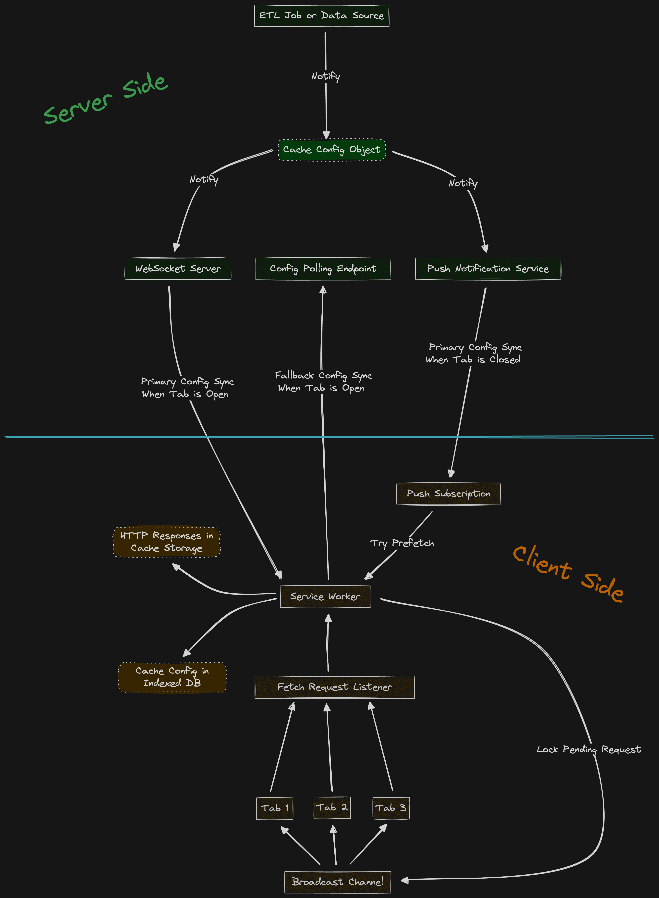

# FullCache


> **Zero-effort caching. Maximum performance. Universal compatibility.**

FullCache is a modular, framework-agnostic client-side caching engine that transparently intercepts all `fetch` requests, reduces redundant network calls, and syncs data across tabs – all powered by a background `ServiceWorker`.

## 🔍 What Makes FullCache Different?

- Works entirely from the browser – no code changes in API clients
- Doesn’t _guess_ freshness – it knows it
- Avoids cache duplication via smart keys & coordination across tabs
- Modular and pluggable: use what you need, extend if needed  
  &nbsp;

---

&nbsp;

## 🧠 Why FullCache?

### The Problem: Legacy Caching Falls Short

Traditional browser caching has always focused on static assets – images, CSS, HTML, and even static JS bundles. But dynamic API data? That’s still largely unmanaged:

- 🤔 **CDNs** help with static files, but don’t solve dynamic data freshness
- 🤔 **ETags & Last-Modified** reduce bandwidth but still require a roundtrip to the server
- 🤔 **Server-side caching** (Redis, Memcached) helps backend load, but not client speed
- 🤔 **Manual client caching** is messy, error-prone, and inconsistent across tabs
- 🤔 Many developers avoid caching altogether for fear of showing stale data

Even popular libraries like **React Query**, **SWR**, or wrappers around **Axios** only solve isolated parts of the caching puzzle — such as client state revalidation or memory caching. They don't offer a full-stack, cross-tab, long-term, persistent caching infrastructure with coordination, deduplication, freshness policies, and background sync.

Meanwhile, modern browsers have powerful storage and compute capabilities – but most apps still fetch the same data repeatedly, wasting bandwidth and processing time.

### FullCache: A Better Model

In addition to intercepting fetches and managing local freshness, FullCache connects to your backend via `WebSocket`. This allows your server to push real-time updates – such as precise `lastModified` timestamps – whenever data changes (e.g., after an ETL finishes). The result: your cache is always aligned with your actual data, with no polling or guessing involved.

We believe caching should be:

- ✅ **Transparent** – it just works, no code changes required
- ✅ **Configurable** – define what matters, down to the endpoint or method level
- ✅ **Precise** – avoid stale data while still saving every possible call
- ✅ **Proactive** – fetch what users will need before they even ask, including through background sync and push notifications that update cached data even when the app is closed
- ✅ **Synchronized** – all tabs aligned, deduped, and up to date
- ✅ **Pushed** – your server should be able to notify the client of data changes in real time, ensuring the cache stays perfectly in sync

FullCache offers a **unified, smart, and proactive caching layer** that lives in the Service Worker and turns your app into a bandwidth-efficient, lightning-fast powerhouse.  
&nbsp;

---

&nbsp;

## 🚀 Key Benefits

- 🔑 **Smart Cache Keying** – FullCache creates stable cache keys by normalizing request data: sorting objects and arrays, ignoring param order, and supporting header-based overrides. This boosts cache reuse and avoids unnecessary misses.
- 🧠 **Smart Deduplication** – Prevents identical fetches from being sent twice (even across tabs!)
- 🌐 **Cross-tab Sync** – Updates, invalidations, and responses are shared via BroadcastChannel
- 🔄 **Live Configuration** – Cache rules & freshness logic updated in real time (via `WebSocket` or polling)
- 🔥 **Prefetch Engine** – Pulls in data _before_ it’s needed, even when your app is closed
- 🧱 **Framework-Free** – No dependency on React, Vue, Angular, or any framework – just pure JavaScript
- 💾 **Storage-Aware** – `CacheStorage` for responses, `IndexedDB` for configuration  
  &nbsp;

---

&nbsp;

## 🧱 Architecture Overview

  
&nbsp;

---

&nbsp;

## 📦 Installation & Usage

> Coming soon – not yet published to npm

```sh
npm install full-cache
```

&nbsp;

---

&nbsp;

This setup registers the `ServiceWorker` and initializes FullCache with:

- The path to your custom service worker script
- `WebSocket` URL for receiving real-time configuration updates
- Fallback polling URL and interval (used only when `WebSocket` fails) – Optional
- Origin filtering to ignore certain requests (e.g. dev environments)

```js
import * as FullCache from 'full-cache';

await FullCache.init({
  webSocketServerUrl: 'ws://api.example.com/ws',
  cacheName: 'api-cache-v1',
  workerPath: '/service-worker.js',
  fallbackPollingServerUrl: 'https://api.example.com/cache-config',
  fallbackPollingIntervalMs: 1000,
  ignoreOrigins: ['https://client-side.example.com'],
});
```

&nbsp;

### 🔧 `FullCache.init()` Options

| Option                      | Type       | Required | Description                           |
| --------------------------- | ---------- | -------- | ------------------------------------- |
| `webSocketServerUrl`        | `string`   | ✅       | WebSocket endpoint for config updates |
| `fallbackPollingServerUrl`  | `string`   | ❌       | HTTP endpoint for config fallback     |
| `fallbackPollingIntervalMs` | `number`   | ❌       | How often to poll if WS fails         |
| `cacheName`                 | `string`   | ✅       | Name of the `CacheStorage` bucket     |
| `workerPath`                | `string`   | ✅       | URL of your custom service worker     |
| `ignoreOrigins`             | `string[]` | ❌       | Origins to exclude from caching       |

&nbsp;

---

&nbsp;

## 🛠 Defining Cache Behavior (Server-Side)

📌 **By default, only endpoints explicitly listed in the configuration will be cached.** Any `fetch` call not matching a configured host + endpoint + method will bypass FullCache and go directly to the network.

⏱️ **Note:** While we use the `ttl` field to determine response freshness, the real strength of FullCache lies in its use of accurate `lastModified` timestamps.

In most systems, TTLs are just educated guesses. But with FullCache, you can push exact modification times from your backend whenever data is updated (e.g., after an ETL process finishes). This ensures precision-driven caching, avoiding unnecessary requests while guaranteeing freshness.

TTL acts as a fallback mechanism – it helps when real-time config updates are temporarily unavailable (e.g., offline mode or WebSocket failure) – but ideally, it's rarely the deciding factor.

### 🧩 `CacheConfig` Structure

The configuration supports four levels: global, host, endpoint, and method. Configuration is resolved hierarchically using a top-down override mechanism: values defined at the method level override those from the endpoint level, which override host-level settings, and so on.

📌 Each method's `CacheSettings` must include **at least one** of the following:

- `ttl`: for time-based freshness
- `lastModified`: for exact data-driven freshness  
  You may specify both – `lastModified` takes precedence when available.

Here's the full structure represented in TypeScript:

```ts
/**
 * Represents the configuration settings for caching behavior.
 * This interface allows customization of cache keys, prefetching strategies,
 * and cache entry freshness based on timestamps or time-to-live (TTL) values.
 */
interface CacheSettings {
  /**
   * An optional list of HTTP headers to be used as part of the cache key.
   * These headers can help differentiate cached responses based on request-specific metadata.
   */
  keyHeaders?: string[];

  /**
   * Specifies the prefetching strategy for cache entries.
   * - `always`: Prefetch is always performed.
   * - `on-load`: Prefetch is triggered when the cache is loaded.
   * - `on-update`: Prefetch is triggered when the cache is updated.
   * - `never`: Prefetching is disabled.
   */
  prefetch?: 'always' | 'on-load' | 'on-update' | 'never';

  /**
   * An optional timestamp (in milliseconds) indicating the last modification time of the cache.
   * Used to determine freshness by comparing it with the cached entry's last modification time.
   */
  lastModified?: number;

  /**
   * An optional time-to-live (TTL) value in milliseconds for cache entries.
   * Determines freshness by checking if the cached entry's last modification time
   * plus the TTL exceeds the current time.
   */
  ttl?: number;

  /**
   * Defines the caching strategy to apply for requests and responses.
   * - `cache-first`: Return cache if available, otherwise fetch from the network.
   * - `network-first`: Attempt network first; fall back to cache if it fails.
   * - `stale-while-revalidate`: Serve stale cache immediately, then update in the background.
   * - `network-only`: Never use cache; always fetch from the network.
   *
   * Defaults to `'cache-first'` if not specified.
   */
  strategy?: 'cache-first' | 'network-first' | 'stale-while-revalidate' | 'network-only';

  /**
   * Specifies which HTTP response status codes should be considered valid for caching.
   * Each entry is a tuple representing a closed interval `[min, max]` (inclusive),
   * and a response will be cached if its status falls within one of the specified ranges.
   *
   * For example:
   *   [[200, 299]]               // default - cache only successful responses
   *   [[200, 299], [404, 404]]  // also cache 404 responses
   */
  cacheIfStatusIn?: [number, number][];

  /**
   * Configuration options for generating cache keys.
   */
  key?: {
    /**
     * Determines whether the order of query parameter names should be ignored.
     * If enabled, '?a=1&b=2' and '?b=2&a=1' will be treated as equivalent.
     * Defaults to `true`.
     */
    ignoreQueryKeysOrder?: boolean;

    /**
     * Determines whether the order of body property names should be ignored.
     * Defaults to `true`. If `ignoreBodyKeysOrderRecursively` is enabled, this option is ignored.
     */
    ignoreBodyKeysOrder?: boolean;

    /**
     * Determines whether the order of body property names should be ignored recursively,
     * including nested objects and arrays of objects.
     * Defaults to `true`.
     */
    ignoreBodyKeysOrderRecursively?: boolean;

    /**
     * Determines whether the order of array items should be ignored in both query parameters and body.
     * Defaults to `true`.
     */
    ignoreArraysOrder?: boolean;

    /**
     * Determines whether the case of query parameter names (keys) should be ignored.
     * For example, 'UserId' and 'userid' will be treated as equivalent.
     * Defaults to `true`.
     */
    ignoreQueryKeysCase?: boolean;

    /**
     * Determines whether the case of body property names (keys) should be ignored.
     * Defaults to `true`.
     */
    ignoreBodyKeysCase?: boolean;

    /**
     * Determines whether the case of query parameter values should be ignored.
     * For example, 'lang=EN' and 'lang=en' will be treated as equivalent.
     * Defaults to `false`.
     */
    ignoreQueryValuesCase?: boolean;

    /**
     * Determines whether the case of body values should be ignored.
     * For example, `{ role: 'Admin' }` and `{ role: 'admin' }` will be treated as equivalent.
     * Defaults to `false`.
     */
    ignoreBodyValuesCase?: boolean;

    /**
     * If enabled, numeric strings like "10.0" and "10" will be treated as equivalent
     * when generating the cache key.
     * Applies to both query parameters and body values.
     * Defaults to `false`.
     */
    normalizeNumericValues?: boolean;

    /**
     * If enabled, string values in both query parameters and request body will be trimmed,
     * i.e., leading and trailing whitespace will be removed.
     * This ensures that " value " and "value" are treated as equivalent.
     * Defaults to `false`.
     */
    trimStringValues?: boolean;

    /**
     * If enabled, nullish query parameters (i.e., null, undefined, or empty strings)
     * will be excluded from the cache key.
     * Defaults to `true`.
     */
    ignoreNullishQueryParams?: boolean;

    /**
     * If enabled, nullish body keys (i.e., keys with null, undefined, or empty string values)
     * will be excluded from the cache key.
     * Defaults to `true`.
     */
    ignoreNullishBodyKeys?: boolean;

    /**
     * If enabled, nullish body keys will be excluded recursively from nested objects
     * and arrays during cache key generation.
     * Defaults to `true`.
     */
    ignoreNullishBodyKeysRecursively?: boolean;

    /**
     * Determines whether to include query parameters at all when generating the cache key.
     * If set to `false`, query parameters will be ignored completely.
     * Defaults to `true`.
     */
    includeQueryParams?: boolean;

    /**
     * Determines whether to include the request body when generating the cache key.
     * If set to `false`, the request body will be ignored completely.
     * Defaults to `true`.
     */
    includeRequestBody?: boolean;
  };
}

/**
 * Represents the full cache configuration structure, including global settings and
 * per-host, per-endpoint, and per-method overrides.
 *
 * This config allows fine-grained control over caching behavior at multiple levels:
 * - Global settings (applies to all requests unless overridden)
 * - Per-host settings
 * - Per-endpoint settings (within a host)
 * - Per-method settings (within an endpoint)
 */
interface CacheConfig {
  /**
   * Optional time-to-live (TTL) in milliseconds for the entire configuration object.
   * This TTL is only used when the WebSocket connection is unavailable **and**
   * fallback polling is not enabled or fails.
   *
   * If the TTL expires and no fresh config is available, the cached config should be considered invalid.
   */
  configTTL?: number;

  /**
   * Default/global cache settings applied to all requests,
   * unless overridden at the host, endpoint, or method level.
   */
  settings: CacheSettings;

  /**
   * A mapping of hostnames (e.g., 'api.example.com') to their specific cache configuration.
   * Each host can override the global settings and define its own endpoint-level and method-level behavior.
   */
  hosts: {
    [host: string]: {
      /**
       * Host-level cache settings that override the global settings
       * for all requests made to this host, unless overridden further by endpoint/method.
       */
      settings: CacheSettings;

      /**
       * A mapping of endpoint paths (e.g., '/products', '/users/:id') within the host,
       * allowing customization of cache behavior per endpoint.
       */
      endpoints: {
        [endpoint: string]: {
          /**
           * Endpoint-level cache settings that override the host/global settings
           * for all requests to this endpoint, unless overridden by method-specific rules.
           */
          settings: CacheSettings;

          /**
           * A mapping of HTTP methods (e.g., 'GET', 'POST') to their specific cache settings,
           * providing the most granular level of control.
           */
          methods: {
            [method: string]: CacheSettings;
          };
        };
      };
    };
  };
}
```

&nbsp;

### 💡 Example Configuration

```ts
const exampleConfig: CacheConfig = {
  configTTL: 3600000, // 1 hour
  settings: {
    keyHeaders: ['Authorization', 'Content-Type'],
    prefetch: 'on-load',
    ttl: 60000, // 1 minute
  },
  hosts: {
    'api.example.com': {
      settings: {
        keyHeaders: ['Authorization'],
        prefetch: 'always',
        lastModified: 1711646400000, // Set dynamically by server
        ttl: 120000, // 2 minutes
      },
      endpoints: {
        '/users': {
          settings: {
            prefetch: 'on-update',
            ttl: 300000, // 5 minutes
          },
          methods: {
            GET: {
              keyHeaders: ['Authorization'],
              prefetch: 'always',
              ttl: 60000, // 1 minute
            },
            POST: {
              prefetch: 'never',
            },
          },
        },
        '/products': {
          settings: {
            prefetch: 'on-load',
            ttl: 180000, // 3 minutes
          },
          methods: {
            GET: {
              prefetch: 'always',
              lastModified: 1711646400000, // Set dynamically by server
              ttl: 120000, // 2 minutes
            },
            POST: {
              prefetch: 'on-update',
              ttl: 60000, // 1 minute
            },
          },
        },
      },
    },
    'api.another.com': {
      settings: {
        prefetch: 'never',
        ttl: 300000, // 5 minutes
      },
      endpoints: {
        '/orders': {
          settings: {
            prefetch: 'on-update',
            lastModified: 1711646400000, // Set dynamically by server
            ttl: 600000, // 10 minutes
          },
          methods: {
            GET: {
              prefetch: 'on-load',
              lastModified: 1711646400000, // Set dynamically by server
              ttl: 300000, // 5 minutes
            },
            POST: {
              prefetch: 'never',
            },
          },
        },
        '/inventory': {
          settings: {
            prefetch: 'always',
            ttl: 120000, // 2 minutes
          },
          methods: {
            GET: {
              prefetch: 'on-load',
              lastModified: 1711646400000, // Set dynamically by server
            },
            POST: {
              prefetch: 'on-update',
              ttl: 180000, // 3 minutes
            },
          },
        },
      },
    },
  },
};
```

&nbsp;

---

&nbsp;

## 🌐 Backend Integration Examples

To support FullCache on the backend, you can use any server (Node.js, Python, Go, etc.) to expose two interfaces:

### 1. `WebSocket` Push Server

Send updated `lastModified` timestamps + config when data changes (e.g. after ETL):

```ts
// Node.js (ws example)
import WebSocket, { WebSocketServer } from 'ws';

async function getCacheConfig() {
  // Fetch the cache config from a shared resource like Redis, DB, in-memory object etc.
}

const webSocketServer = new WebSocketServer({ port: 8080 });

webSocketServer.on('connection', (client: WebSocket) => {
  function sendConfig() {
    const cacheConfigResponse = JSON.stringify({
      type: 'CACHE_CONFIG',
      data: await getCacheConfig(),
    });
    client.send(cacheConfigResponse);
  }

  client.on('message', message => {
    const request = JSON.parse(message.toString());

    // Once a client connects, send the initial cache configuration
    if (request.type === 'INIT') {
      sendConfig();
    }
  });

  // later, when ETL finishes or data changes
  sendConfig();
});
```

### 2. Fallback Polling Endpoint

Returns the latest config if `WebSocket` is unavailable:

```ts
// Node.js (Express)
app.get('/cache-config', async (req, res) => {
  const cacheConfig = await getCacheConfig();
  res.json(cacheConfig);
});
```

### 3. Push Notifications for Background Updates

FullCache supports proactive cache freshness, even when the app is closed, through backend integration with push and background sync mechanisms.

To enable this, the backend should:

```ts
import webPush from 'web-push';

const subscription = getStoredSubscription(userId); // VAPID details, etc.

const payload = JSON.stringify({
  type: 'CACHE_CONFIG',
  data: await getCacheConfig(),
});

await webPush.sendNotification(userSubscription, payload);
```

This will trigger an update in the Service Worker, even if the app is closed.  
&nbsp;

---

&nbsp;

## 🔜 Roadmap

### 🧠 Developer Experience

- [ ] Debug panel (DevTools integration)
- [ ] Telemetry hooks
- [ ] CLI tool for inspecting or clearing cache
- [ ] Visual debug overlay showing cache hits/misses in UI

### 🔐 Advanced Features

- [ ] Encrypted cache support
- [ ] Pluggable strategies (e.g., stale-while-revalidate, network-first)
- [ ] Custom cache key generators
- [ ] Plugin system for extending behavior

### 📡 Real-Time Sync

- [ ] Peer-to-peer tab sync (e.g. via WebRTC)
- [ ] Delta updates instead of full config payload

### 📦 Offline & Static Assets

- [ ] Offline-first fallback mode for all `fetch` calls
- [ ] Offline replay queue (retry on reconnect)
- [ ] Runtime caching for static assets (CSS, JS, images)
- [ ] Asset precache manifest support (Workbox-style)
- [ ] Strategy definitions per asset type (cache-first, SWR, etc.)

### 🌍 Ecosystem Integrations

- [ ] Libraries for backend support in:
  - [ ] Node.js (Express, Fastify, Hapi, NestJS)
  - [ ] Python (Flask, FastAPI, Django)
  - [ ] C# (.NET Core, ASP.NET MVC)
  - [ ] Go (Gin, Chi, Echo)
  - [ ] Ruby (Rails, Sinatra)
  - [ ] PHP (Laravel, Symfony)
  - [ ] Java (Spring Boot, Vert.x, Micronaut)
  - [ ] Rust (Actix Web, Rocket)
  - [ ] Elixir (Phoenix)
  - [ ] Kotlin (Ktor, Spring K)
  - [ ] Scala (Play, Akka HTTP)
  - [ ] Dart (Shelf, Aqueduct)
  - [ ] gRPC (cross-language support for proto-defined APIs)
- [ ] Adapters for React, Vue, Angular, Svelte, SolidJS, Qwik (optional helpers, not required)
- [ ] GraphQL support (automatic cache rules for query names/types)

### 🧪 Experimental Ideas

- [ ] Heuristic TTL estimation for unknown endpoints
- [ ] Streaming response support – cache and replay `ReadableStream` API bodies
- [ ] Smart prefetch prioritization based on device/network
- [ ] Telemetry dashboards for cache performance
- [ ] Encrypted cache support
- [ ] Telemetry hooks
- [ ] Pluggable strategies (stale-while-revalidate, etc.)  
       &nbsp;

---

&nbsp;

## 🧯 Known Limitations

- Responses with streaming bodies are not cached (planned support via `ReadableStream`)
- `ServiceWorker` must be on the same origin
- Push requires user permission and HTTPS  
  &nbsp;

---

&nbsp;

## 📄 License

MIT (to be confirmed)
